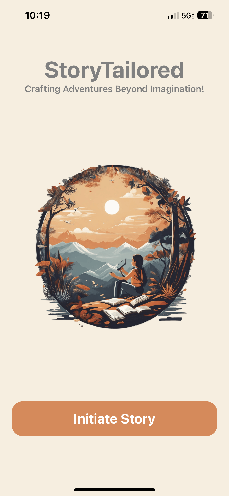

# HackNC Mad Hackers

## :rocket: What is it about? 

StoryTailored, where your imagination takes the reins! 

StoryTailored is not just an app; it's your portal to a world of limitless creativity and adventure. Much like the epic tales of Dungeons and Dragons, this app empowers you to craft your own unique stories. With the guidance of ChatGPT, your storytelling companion, embark on a journey of boundless imagination. Whether you're a seasoned Dungeon Master or a novice storyteller, StoryTailored is your canvas to paint the most extraordinary, imaginative, and immersive narratives. Let your stories come to life, one chat at a time, with StoryTailored.

## 😄 What's in the name?

The name "StoryTailored" combines two key concepts: "Story" and "Tailored," which together reflect the app's core purpose and functionality.

1. "Story": This part of the name emphasizes the app's focus on storytelling and narrative creation.

2. "Tailored": This word implies customization and personalization.

## 💻 What is our Tech Stack?

We built this app using [**React native**](https://reactnative.dev/docs/environment-setup) and for simulation we used [**Expo**](https://docs.expo.dev/get-started/installation/) which enables our app to run both on iOS and Android.
We use Large Language Model (GPT 3.5) aka [**ChatGPT**](https://chat.openai.com/) to generate the creative responses. 
Please find the specific node modules in `package.json`.

## :iphone: How does our App look like?

         
  

## Our Team Members:
Sukhad Joshi [@sukhadj](https://github.com/sukhadj)

Anagha Patil[@Anagha-2000](https://github.com/Anagha-2000)

Christopher Williams[@encore488](https://github.com/encore488)

Denthin[@Denthin](https://github.com/Denthin)

This project is a part of HackNC 2023 hackathon. Appreciated by many :heart: